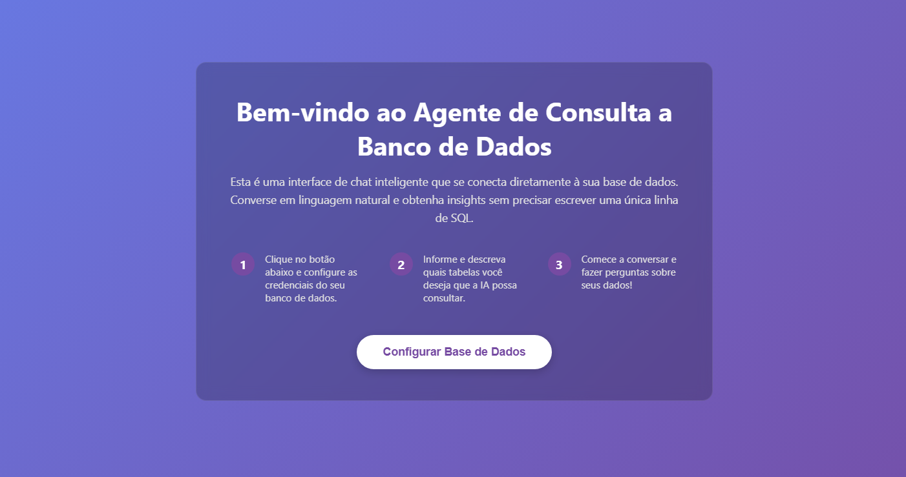
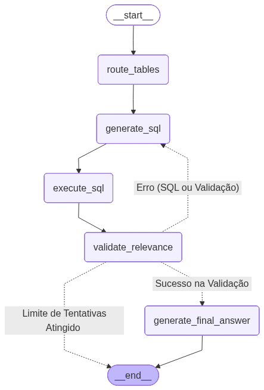

# 🤖 Agente de Chat com Banco de Dados
    Converse com seus dados em linguagem natural usando o poder da Inteligência Artificial.

Este projeto é uma aplicação web completa que permite a usuários não-técnicos fazerem perguntas complexas a um banco de dados (como SQLite, SQL Server, PostgreSQL, etc.) usando apenas a linguagem do dia a dia. A IA traduz a pergunta em uma consulta SQL, executa no banco e devolve a resposta de forma clara e compreensível.



# ✨ Funcionalidades Principais
- **Interface de Chat Intuitiva:** Uma interface de chat moderna e responsiva construída com React e TypeScript.
- **Configuração Dinâmica:** Um modal de configuração permite que o usuário conecte a aplicação a qualquer banco de dados suportado pelo SQLAlchemy, sem precisar alterar o código.
- **Tradução de Linguagem Natural para SQL:** Utiliza um modelo de linguagem avançado (LLM) para converter perguntas como "Qual cliente comprou mais teclados?" em consultas SQL válidas.
- **Suporte a Múltiplos Bancos:** Graças ao SQLAlchemy, a aplicação é compatível com diversos sistemas de banco de dados.
- **Gerenciamento de Contexto:** A conversa possui memória e capacidade de resumir interações longas para otimizar o desempenho e economizar tokens.

# 🛠️ Tecnologias Utilizadas
- Backend:
    - Python
    - FastAPI
    - Langgraph
    - OpenAI
    - ChormaDB
    - SQLAlchemy
- Frontend:
    - TypeScript
    - React
    - Vite


# 📋 Pré-requisitos
Antes de começar, garanta que você tenha os seguintes softwares instalados:

- **Python 3.9+**
- **Node.js 18+** e **npm**
- Uma **chave de API da OpenAI**
- Acesso a um banco de dados (ex: um arquivo SQLite ou credenciais para um servidor SQL Server, PostgreSQL, etc.)

# ⚙️ Instalação e Execução
O projeto é dividido em duas partes: Backend (servidor FastAPI) e Frontend (aplicação React). Você precisará de dois terminais para executá-los simultaneamente.

1. Backend (Servidor FastAPI)

    a. Clone o repositório e prepare o ambiente:
    ```
    # Ambiente virtual
    python -m venv venv
    source venv/bin/activate  # No Windows: venv\Scripts\activate

    # Instale as bibliotecas
    pip install requirements.txt
    ```

    b. Configure sua chave de API:
    Crie um arquivo chamado .env na raiz da pasta backend e adicione sua chave da OpenAI:
    ```
    OPENAI_API_KEY="sk-sua-chave-aqui"
    ```

    c. Execute o servidor:
    ```
    uvicorn main:app --reload
    ```
    O backend estará rodando em http://127.0.0.1:8000.

2. Frontend (Aplicação React)

    a. Navegue até a pasta do frontend e instale as dependências:
    ```
    # Em um novo terminal
    cd ../frontend
    npm install
    ```

    b. Configure sua URL da API:
    Crie um arquivo chamado .env na raiz da pasta chat-frontend e adicione sua URL da API backend:
    ```
    VITE_API_BASE_URL=http://127.0.0.1:8000
    ```

    c. Execute a aplicação:
    ```
    npm run dev
    ```
    O frontend estará acessível em http://localhost:5173 (ou outra porta indicada no terminal).

# 📖 Como Usar
- **Acesse a Aplicação:** Abra seu navegador e acesse a URL do frontend (ex: http://localhost:5173).
- **Página de Boas-Vindas:** Você verá uma página explicando o projeto. Clique no botão "Configurar Base de Dados".
- **Configure o Agente:** Um modal aparecerá. Preencha os seguintes campos:
    - **Dialeto do SQLAlchemy:** O dialeto específico para o seu banco (ex: sqlite, mssql+pyodbc).
    - **String de Conexão:** A string de conexão completa do seu banco de dados.
    - **Tabelas para Consulta:** Adicione o nome e uma boa descrição para cada tabela que a IA deve ser capaz de consultar. A qualidade da descrição impacta diretamente a performance da IA.
- **Inicie o Chat:** Clique em "Iniciar Chat". Se a conexão com o banco for bem-sucedida, o modal se fechará.
- **Converse com seus Dados:** A interface de chat será carregada. Você verá as tabelas configuradas no cabeçalho e uma mensagem de boas-vindas. Agora é só fazer suas perguntas!

Obs.: A aplicação ja possui dados de exemplo. Dessa forma você pode testar de maneira simples.
- **Exemplo:** "Qual cliente da cidade de São Paulo gastou mais no total?"
- **Exemplo:** "Liste os 5 produtos mais vendidos no último mês."

# Fluxo Agente
O processo é dividido em duas fases principais: a Configuração, que ocorre uma vez, e a Execução da Pergunta, que ocorre a cada nova mensagem do usuário.

**Fase 1 - Configuração e Indexação da Base de Conhecimento**
Esta fase é executada quando o endpoint ```/configure_agent``` é chamado com a configuração final. O objetivo é preparar o contexto para o agente.

1. **Entrada do Usuário:**
    - O sistema recebe as credenciais do banco de dados e uma lista de tabelas de interesse, cada uma com um nome e uma descrição textual fornecida pelo usuário.

2. **Extração de Schema:**
   - O backend conecta-se ao banco de dados especificado. Para cada tabela na lista de interesse, ele extrai o schema técnico completo (a estrutura ```CREATE TABLE``` com todas as colunas e seus tipos de dados).

3. **Vetorização (Embedding):**
   - Para cada tabela, a **descrição** em texto fornecida pelo usuário é enviada a um modelo de embedding (ex: ```text-embedding-3-small``` da OpenAI). Este modelo converte a descrição em um vetor (uma representação numérica de seu significado semântico).

4. **Indexação no Banco Vetorial:**
   - O vetor gerado é armazenado em uma coleção do ChromaDB em memória. O nome da tabela e seu schema técnico completo são armazenados como **metadata**, diretamente associados a esse vetor, mas sem serem vetorizados.

Ao final desta fase, o sistema possui um índice de busca semântica em memória, onde cada descrição de tabela é representada por um vetor e está vinculada ao seu schema técnico.


**Fase 2 - Execução de uma Pergunta**
Este fluxo é executado a cada chamada ao endpoint ```/query```.

1. **Roteamento de Tabelas (```Route Tables```):**
    - A pergunta do usuário (ex: "Qual ano teve mais terremotos?") é convertida em um vetor usando o mesmo modelo de embedding.
    - O ChromaDB realiza uma busca por **similaridade semântica** (distância de cosseno), comparando o vetor da pergunta com os vetores das descrições das tabelas já indexadas.
    - As ```N``` tabelas mais semanticamente relevantes são identificadas. Os **metadados** dessas tabelas (incluindo seus schemas) são recuperados.

2. **Geração de SQL (```Generate SQL```):**
    - Os schemas das tabelas recuperadas na etapa anterior são combinados com a pergunta original do usuário para formar um prompt de contexto.
    - Este prompt é enviado a um Large Language Model (LLM) com a instrução de gerar uma única e sintaticamente correta query SQL para responder à pergunta.

3. **Execução de SQL (```Execute SQL```):**
    - A query SQL gerada pelo LLM é executada diretamente no banco de dados de destino através do SQLAlchemy.
    - Esta abordagem garante um resultado determinístico e otimiza o uso da janela de contexto, pois evita passar grandes volumes de dados brutos da tabela para o LLM. O resultado da query é retornado para o próximo passo.

4. **Validação de Relevância (```Validate Relevance```):**
    - O resultado da query, a query SQL e a pergunta original são enviados a um LLM para uma validação.
    - A IA verifica se o resultado obtido é uma resposta lógica e relevante para a pergunta feita. Em caso de falha, o processo pode retornar à etapa de Geração de SQL para uma nova tentativa (configurado para um máximo de 3 tentativas).

5. **Geração da Resposta Final (```Generate Final Answer```):**
    - Após a validação, o resultado da query SQL e a pergunta original são enviados ao LLM.
    - A tarefa final do modelo é sintetizar esses dados brutos em uma resposta coesa e em linguagem natural para ser apresentada ao usuário.



